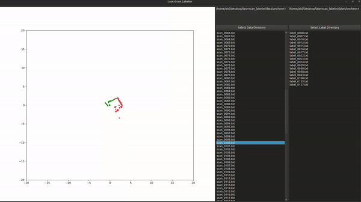

## LaserScan Labeler for PySide Study

!pip3 install pyside6==6.4.0
!pip3 install matplotlib==3.6.2

Event List
 - Mouse wheel down/up: Zoom in and out on the canvas
 - Mouse drag: Select points within the drawn rectangle
 - Right arrow key: Move to the next data set
 - Left arrow key: Move to the previous data set
 - ESC key: Save the label
